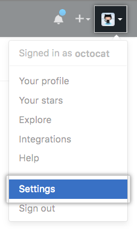

Topic
```
Introduction to GIT  
Install Git
GIT basic commmands
GIT branching
Working with remote GIT repository
```
scm history: from file and patch to system  
    History Tracking
    Collaborative History Tracking
        who is change it
        when do they change it
        why do they change it

1. Introduction to GIT   
    Version Control System Types?  
      

    Centralized Version Control  
      

    Distributed Version Control  
      

    Delta Based Storage  
      

    DAG Based Storage(directed acyclic graph)  
      

    เป้าหมายการออกแบบ[รูป]  
        Speed  
        Simple Design  
        Support for Many Parallel Branches  
        Fully Distributed  
        To Handle Large Project Like Linux Kernel  

    ?Git Workflow ที่ ฟิวส์ แปล   

    Who use Git
    

2. Install Git  
    Manual Install[mac, window, linux]
        download: http://git-scm.com
    Install via package manager   
    mac
    ```
    brew install git
    ```
    ubuntu
    ```
    apt-get install git
    ```
    Configuration Git on Local Machine
    ```
    git config --global user.name "your name"
    git config --global user.email "your email"
    git config -l
    ```

3. GIT basic commands  
    Create a repository
    ```bash
    git init
    ```
    Check Status
    ```bash
    git status
    ```
    Add files to Git  
    ```bash
    git add filename
    ```
    Commit your changes
    ```bash
    git commit -m "Message for this change"
    ```
    Remove file from Git
    ```
    git rm filename
    ```

    Example  
    * Create a repository[go to workspace]  
    ```bash
    mkdir git101
    cd git101
    git init
    ```

    * Add files to Git  
     * Create file name README   
     * Check status with git status  

    ```bash
    touch README
    git status
    git add README
    ```
    * Commit your changes
    ```bash
    git commit -m "Add README"
    ```
    * Modify README
    ```bash
    echo "Hello Git" > README
    ```
    * Commit your changes
    ```bash
    git commit -m "Add Hello Git to README"
    ```
    * Add new file to Git  
     * Create file name TMP

    ```bash
    touch TMP
    git add TMP
    ```
    * Commit your changes
    ```bash
    git commit -m "Add TMP"
    ```
    * Remove TMP
    ```bash
    git rm TMP
    git status
    ```

    TIPs
    ```bash
    git help
    git help command
    ```

    Lift cycle of the status of files
    

4. GIT branching
    * branch? + pic and flip chart

    * Command
    ```bash
    git branch BRANCH NAME
    git checkout BRANCH NAME
    ```

    Example
    * Create new branch + pic
    ```bash
    git branch dev
    ```
    * Switch branch + pic
    ```bash
    git checkout dev
    ```
    * Modify and commit on branch + pic
    ```bash
    echo "On Branch dev" > README
    git commit -am "Modify on dev"
    ```
    * Switch to master branch + pic
    ```bash
    git checkout master
    ```
    TIPs:
    * Create and Switch branch
    ```bash
    git checkout -b BRANCH NAME

    equals

    git branch BRANCH NAME
    git checkout BRANCH NAME
    ```
    * Merge branch dev to master? + pic
    ```bash
    git merge dev
    ```
    * Delete branch
    ```bash
    git branch -d BRANCH NAME
    ```
    * Show all Branches
    ```bash
    git branch
    ```

5. Working with remote GIT repository[github]
    * Generate ssh key
    ```bash
    ssh-keygen
    pbcopy < ~/.ssh/id_rsa.pub
    ```
    * Add key to github
     * Click your profile photo, then click Settings  
       

     * Click SSH and GPG keys, In the user settings sidebar  
       

     * Click New SSH key  
       

     * Paste your key into the "Key" field  
       

    * Testing your SSH connection
    ```bash
    ssh -T git@github.com
    ```
    * Add remote repository
    ```bash
    git remote add NAME REMOTE_URL
    ```
    * Remove remote repository
    ```bash
    git remote remove NAME
    ```
    * Rename remote repository
    ```bash
    git rename OLD_NAME NEW_NAME
    ```
    * Push changes to remote
    ```bash
    git push NAME BRANCH
    ```
    * Pull changes from remote
    ```bash
    git pull NAME BRANCH

    equals

    git fetch NAME
    git merge BRANCH
    ```

    * Green Field Project  
     * Create New Repository on github name git101  
       

     * Clone project from remote  
    ```bash
    git clone git@github.com:username/git101.git [NEW_NAME]

    or

    git clone https://github.com/username/git101.git [NEW_NAME]
    ```
    * Existing Project
     * Create a repository
    ```bash
    git init
    ```
     * Create New Repository on github[The same step as Green Field Project]
     * Add remote repository
    ```bash
    git remote add origin git@github.com:username/git101.git [NEW_NAME]

    or

    git remote add origin https://github.com/username/git101.git [NEW_NAME]
    ```

Online Tutorial  
https://try.github.io/levels/1/challenges/1  
https://onlywei.github.io/explain-git-with-d3/  
http://learngitbranching.js.org/  
http://git.mikeward.org/
