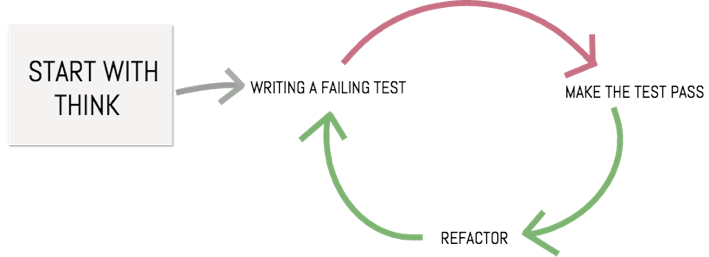

# Test driven development

programming is like exploring a dark house. You go from
room to room to room. Writing the test is like turning on the light. Then you can avoid
the furniture and save your shins (the clean design resulting from refactoring). Then
you’re ready to explore the next room.

#### TDD is like shining light into darkroom one at a time


## TDD Exercise : Fizzbuzz

```
From
http://codingdojo.org/kata/FizzBuzz/
```

#### Problem description

```
Imagine the scene. You are eleven years old, and in the five minutes before the end of the lesson, your Maths teacher decides he should make his class more “fun” by introducing a “game”. He explains that he is going to point at each pupil in turn and ask them to say the next number in sequence, starting from one. The “fun” part is that if the number is divisible by three, you instead say “Fizz” and if it is divisible by five you say “Buzz”. So now your maths teacher is pointing at all of your classmates in turn, and they happily shout “one!”, “two!”, “Fizz!”, “four!”, “Buzz!”… until he very deliberately points at you, fixing you with a steely gaze… time stands still, your mouth dries up, your palms become sweatier and sweatier until you finally manage to croak “Fizz!”. Doom is avoided, and the pointing finger moves on.

So of course in order to avoid embarassment infront of your whole class, you have to get the full list printed out so you know what to say. Your class has about 33 pupils and he might go round three times before the bell rings for breaktime. Next maths lesson is on Thursday. Get coding!

Write a program that prints the numbers from 1 to 100. But for multiples of three print “Fizz” instead of the number and for the multiples of five print “Buzz”. For numbers which are multiples of both three and five print “FizzBuzz “.
```

#### Sample of output:
```
1
2
Fizz
4
Buzz
Fizz
7
8
Fizz
Buzz
11
Fizz
13
14
FizzBuzz
16
17
Fizz
19
Buzz
... etc up to 100
```

#### TDD cycle
 


The TDD mantra: Red/Green/Refactor

    - Red: Write a little test that doesn't work, and perhaps doesn't even compile at first.
    - Green: Make the test work quickly, committing whatever sins necessary in the process.
    - Refactor: Eliminate all of the duplication created in merely getting the test to work.


#### Start from understanding

To really understand problem, we can use a "Specification by example" technique by create a table which mapping between given input and correct answer

| Given number(int) | Correct answer(string) |
|-------------------|------------------------|
| 1                 | 1                      |
| 2                 | 2                      |
| 3                 | Fizz                   |
| 4                 | 4                      |
| 5                 | Buzz                   |
| 6                 | Fizz                   |
| 7                 | 7                      |
| 8                 | 8                      |
| 9                 | Fizz                   |
| 10                | Buzz                   |
| 15                | FizzBuzz               |
| 30                | FizzBuzz               |
| 99                | Fizz                   |
| 100               | Buzz                   |

#### Step 1. Write the fail test.

- Create file fizzbuzz.test.js
```js
const fizzbuzz = require("./fizzbuzz.js");

test('Given 1 should return 1', () => {
    expect(fizzbuzz(1)).toBe(1);
});
```
- Execute test to see expected result

```sh
npm test
```
```sh
> fizzbuzz-jest@1.0.0 test /Users/JackSW/workspace/kata/javascript/fizzbuzz-jest
> jest

 FAIL  ./fizzbuzz.test.js
  ● Test suite failed to run

    Cannot find module './fizzbuzz.js' from 'fizzbuzz.test.js'

      at Resolver.resolveModule (node_modules/jest-resolve/build/index.js:179:17)
      at Object.<anonymous> (fizzbuzz.test.js:1:107)
```

#### Step 2. Make the test pass.
- Create file fizzbuzz.js

- Run test again and see what happen.
``` sh
npm test
``` 
``` sh
> fizzbuzz-jest@1.0.0 test /Users/JackSW/workspace/kata/javascript/fizzbuzz-jest
> jest

 FAIL  ./fizzbuzz.test.js
  ● Given 1 should return 1

    TypeError: fizzbuzz is not a function

      at Object.<anonymous>.test (fizzbuzz.test.js:4:12)
      at process._tickCallback (internal/process/next_tick.js:103:7)

  ✕ Given 1 should return 1 (2ms)

Test Suites: 1 failed, 1 total
Tests:       1 failed, 1 total
Snapshots:   0 total
Time:        1.331s
Ran all test suites.
npm ERR! Test failed.  See above for more details.
```

- Add code to fizzbuzz.js
``` js
module.exports = fizzbuzz;

function fizzbuzz(number) {
    return 1;
}
```

- Then run test again
``` sh
> fizzbuzz-jest@1.0.0 test /Users/JackSW/workspace/kata/javascript/fizzbuzz-jest
> jest

 PASS  ./fizzbuzz.test.js
  ✓ Given 1 should return 1 (3ms)

Test Suites: 1 passed, 1 total
Tests:       1 passed, 1 total
Snapshots:   0 total
Time:        1.318s
Ran all test suites.
```


#### Step 3. Look for bad code and refactoring.
- We don't see anything bad for now then skip to next step

#### Repeat
- Mark finished and select the next test case from table

| Given number(int) | Correct answer(string) |
|-------------------|------------------------|
| <del>1                 | <del>1                      |
| 2                 | 2                      |
| 3                 | Fizz                   |
| 4                 | 4                      |
| 5                 | Buzz                   |
| 6                 | Fizz                   |
| 7                 | 7                      |
| 8                 | 8                      |
| 9                 | Fizz                   |
| 10                | Buzz                   |
| 15                | FizzBuzz               |
| 30                | FizzBuzz               |
| 99                | Fizz                   |
| 100               | Buzz                   |

- Repeat step 1 to 3 until the last test case

#### More to read
http://codingdojo.org/kata/FizzBuzz/
https://8thlight.com/blog/uncle-bob/2013/09/23/Test-first.html


